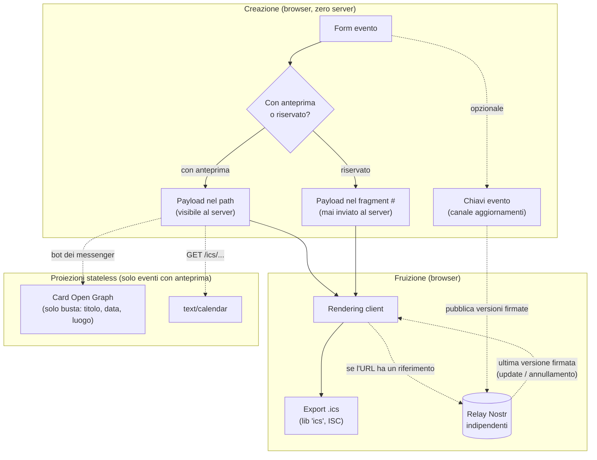

# Evento — visione e architettura di riferimento (v2)

**Stato:** approvata dopo brainstorming e review critica; sostituisce integralmente la v1 (federazione Fediverso read-only), superata a seguito della review avversariale — la v1 resta nella cronologia git.
**Basi:** [fediverse-research.md](fediverse-research.md) (ricerca fact-checked, luglio 2026) e review critica della v1 (contraddizione minting/portabilità, beneficio quasi nullo della presenza ActivityPub, assenza di anteprime e di una storia per modifiche/annullamenti, shortener non persistente, fuso orario mancante).

## Il problema che risolviamo — e per chi

**L'organizzatore informale**: cena di venerdì, calcetto, compleanno. Il suo pubblico esiste già — è il gruppo WhatsApp/Telegram/Signal. Oggi risolve con un messaggio di testo, e i suoi problemi reali sono: il messaggio si perde nella chat, il link condiviso è illeggibile, la gente non mette l'evento in calendario e si dimentica, e quando l'orario cambia il passaparola fa danni.

> **Problem statement.** Aiutare qualcuno a organizzare un evento dentro una conversazione che esiste già, senza far pagare a nessuno il prezzo di una piattaforma (account, dati, lock-in), ma con l'affidabilità minima che un evento richiede: si capisce al volo, finisce in calendario, e i cambiamenti raggiungono chi ha il link.

**Non-goal fondante: non siamo un motore di scoperta eventi.** L'organizzatore di comunità che vuole raggiungere sconosciuti e costruirsi un pubblico è servito bene da [Gancio](https://gancio.org/) e [Mobilizon](https://mobilizon.org/) — glieli indichiamo con affetto. Questa rinuncia è deliberata (decisione D1): la ricerca ha dimostrato che la scoperta federata per un publisher anonimo vale quasi zero, e il nostro utente non ne ha bisogno — la rete di distribuzione decentralizzata di Evento esiste già: sono le chat dei suoi utenti.

## I vincoli (in ordine di priorità)

1. **Il pubblico esiste già.** Nessuna feature che presuppone sconosciuti da raggiungere.
2. **Zero dati utente a riposo sui nostri server** — inclusi log e shortener. Stato presso terzi ammesso solo se: opt-in esplicito, infrastruttura-bene-comune (mai un vendor), e degradabile.
3. **Degradazione elegante come legge.** Se tutto sparisce tranne il link, l'evento resta leggibile. Ogni strato sopra il payload è un'aggiunta, mai una dipendenza.
4. **Sessanta secondi da telefono.** Creare e condividere senza leggere niente; le capacità avanzate non compaiono nel percorso base.
5. **Niente account, mai.** Al massimo chiavi generate silenziosamente dal browser e custodite dal client (URL di modifica, localStorage).
6. **Open source OSI-only; self-hosting a un click** — e l'istanza self-hostata replica tutto, non una versione menomata.

## Architettura: tre piani



### Piano 1 — Il documento (l'unica cosa indispensabile)

L'evento resta un payload autocontenuto nell'URL, ma il formato diventa una **spec pubblica versionata** (`docs/event-format.md`, da scrivere in fase 0):

```
{ v: 2, title, start, end?, tz, location, description?, status, updates? }
```

- **`tz` (fuso orario, IANA) è obbligatorio**: era il difetto latente del modello attuale — senza fuso, il primo export ICS tra fusi diversi produce orari sbagliati.
- **`status`** (`confirmed` | `cancelled`): l'annullamento è un'informazione di prima classe, non un caso speciale.
- **`updates?`**: riferimento facoltativo al canale di aggiornamento (chiave pubblica Nostr + identificatore `d`). La sua assenza è legittima: un evento senza canale è semplicemente immutabile.
- **Regole di compatibilità nella spec**: i decoder accettano tutte le versioni precedenti (i payload attuali senza `v` sono la v1 implicita); i campi sconosciuti si ignorano; la versione sale solo per cambi incompatibili.
- **Consolidamento del codice**: encode/decode/validate oggi triplicati (`src/client/utils/eventUtils.js`, `src/client/services/event/eventService.js`, `netlify/functions/utils/validation.js`) diventano un unico modulo condiviso client/functions — prerequisito di tutto il resto.

La spec pubblica è anche la nostra prima forma di decentralizzazione: **replicabilità radicale**. Chiunque self-hosta un'istanza, e ogni istanza legge gli URL di ogni altra; i link sopravvivono al dominio che li ha generati.

### Piano 2 — La presentazione (proiezioni stateless minime)

Due sole proiezioni, scelte perché servono job reali dell'utente:

- **Card Open Graph per i messenger.** Il payload nel path viene decodificato al volo da una function che serve i meta tag ai bot di anteprima di WhatsApp/Telegram/Slack/Mastodon. È la proiezione a più alto valore dell'intero sistema: rende il link leggibile nel posto esatto dove viene condiviso — e, coprendo l'URL con una card, **elimina il bisogno dello shortener**, che viene rimosso (era stato non persistente: i link corti morivano a ogni redeploy).
- **`/ics/<payload>` → `text/calendar`** per i link `webcal://` e il fetch da macchine, oltre all'export ICS client-side del percorso base.

**Privacy per scelta esplicita, non per effetto collaterale** (decisione D3): alla creazione l'utente sceglie

- **"con anteprima"** — payload nel path: il server (e i bot di anteprima) lo vedono, la card funziona;
- **"riservato"** — payload nel fragment `#`, che il browser non invia mai al server: nessuna traccia nei log, nessuna anteprima, contenuto visibile solo a chi apre il link.

**Postura anti-abuso, ridimensionata alla superficie reale**: la card renderizza _solo la busta_ (titolo, data, luogo — testo breve, sempre escaped, mai HTML dell'utente, mai la descrizione), con etichetta "contenuto fornito dall'utente" e denylist di hash deployabile per i takedown. Il grosso della difesa resta strutturale: il rendering completo è client-side, come oggi.

### Piano 3 — La vita dell'evento (opt-in, degradabile)

Il difetto funzionale più grave del modello "l'URL è il documento" è che gli eventi _cambiano_: orario spostato, luogo diverso, annullamento — e chi ha il vecchio link ha dati sbagliati per sempre. Serve un puntatore mutabile; il vincolo 2 impone che non sia nostro. **I replaceable events di Nostr sono esattamente questo: un puntatore mutabile, decentralizzato e gratuito, custodito da relay indipendenti** (protocollo aperto, libreria `nostr-tools`, Unlicense).

Flusso:

1. Alla creazione (opt-in "voglio poter aggiornare l'evento"), il browser genera una coppia di chiavi — silenziosamente, nessun concetto nuovo per l'utente. La chiave privata vive nel capability URL di modifica dell'organizzatore (e nel suo localStorage).
2. L'URL condiviso contiene il payload **più** il riferimento (`updates`: pubkey + `d`).
3. Chi apre il link vede subito i dati del payload; in background il client interroga i relay: "esiste una versione più recente firmata da quella chiave?" Se sì, mostra l'aggiornamento o l'avviso di annullamento. Se i relay non rispondono, il payload basta.
4. L'organizzatore modifica → il client pubblica la nuova versione firmata sui relay (evento replaceable: i relay tengono solo l'ultima).

Proprietà: nessun dato sui nostri server; i relay vedono solo ciò che l'organizzatore sceglie di rendere aggiornabile; la perdita della chiave degrada l'evento a immutabile (mai a illeggibile); la sparizione dei relay degrada al payload (vincolo 3). Nostr qui non è una feature di pubblicazione per un pubblico che non esiste — è **il canale di aggiornamento per il pubblico che esiste già**.

## RSVP: fuori scope, pianificato come possibilità futura

Il "ci sono!" oggi si dice nella chat, dov'è sempre stato: non competiamo con la conversazione (decisione D5). Ma il disegno lascia lo spazio pronto, se la domanda emergesse:

- **Meccanismo già coerente coi vincoli**: RSVP come eventi Nostr (kind 31925) firmati con chiavi usa-e-getta generate dal browser del partecipante, indirizzati al riferimento dell'evento; il client li conta interrogando i relay. Niente login, niente nostri server, nome facoltativo.
- **Prerequisiti nel formato**: il campo `updates` (pubkey + `d`) è già l'ancora a cui gli RSVP si aggancerebbero; nessuna modifica alla spec necessaria.
- **Criterio di attivazione**: richieste ricorrenti degli utenti — non "perché si può". A scala di gruppo-chat il valore rispetto a "rispondo in chat" è da dimostrare.

## Tecnologie valutate e scartate (registro)

| Tecnologia                                                                 | Verdetto            | Motivo                                                                                                                                                                                                                                                                                                                                                                                           |
| -------------------------------------------------------------------------- | ------------------- | ------------------------------------------------------------------------------------------------------------------------------------------------------------------------------------------------------------------------------------------------------------------------------------------------------------------------------------------------------------------------------------------------ |
| **Federazione ActivityPub piena**                                          | Scartata            | Richiede follower/inbox/code persistenti (= database, dati personali); reach da zero follower ≈ 0 (ricerca, cap. scoperta)                                                                                                                                                                                                                                                                       |
| **Presenza AP read-only (attore + WebFinger + AS2)** — il cuore della v1   | Scartata dal target | Beneficio quasi nullo per il nostro utente (Mastodon rende gli Event come "titolo+link"; nessuno cerca capability URL); il minting HMAC contraddiceva la portabilità tra istanze; la rotazione chiave rompeva la fetchability a lungo termine che il Fediverso pretende. Il formato resta proiettabile in AS2 se un giorno servisse                                                              |
| **h-event / JSON-LD per crawler**                                          | Scartata            | I motori non indicizzano pagine senza inbound link; servire HTML diverso ai bot è cloaking. Sostituita dalle card OG, che servono il caso d'uso reale                                                                                                                                                                                                                                            |
| **RSS/Atom, WebSub**                                                       | Scartate            | Presuppongono collezioni persistenti e topic mutabili lato server                                                                                                                                                                                                                                                                                                                                |
| **Blockchain (ledger, smart contract)**                                    | Scartata            | Test fallito: un evento ha _un solo scrittore_ (la chiave dell'organizzatore) — non serve consenso globale. E ogni costo strutturale colpisce un vincolo: permanenza immutabile vs eventi che vogliono poter cambiare e sparire (privacy); fee vs gratis-per-chiunque; wallet vs niente-account. Riaprire solo se comparisse un problema di scarsità autentica (biglietteria con posti limitati) |
| **IPFS / storage content-addressed**                                       | Scartata            | Il payload viaggia già dentro il link: autocontenuto batte content-addressed (niente da fetchare, niente pinning, niente gateway)                                                                                                                                                                                                                                                                |
| **AT Protocol**                                                            | Scartata            | La scrittura richiede un account (viola il vincolo 5)                                                                                                                                                                                                                                                                                                                                            |
| **URL shortener**                                                          | Rimosso             | Intrinsecamente stateful (quello attuale, in-memory, perde i link a ogni redeploy); il suo job estetico è assorbito dalle card OG                                                                                                                                                                                                                                                                |
| **Nostr NIP-52 come pubblicazione verso il pubblico Nostr** (v1, strato 3) | Ridimensionata      | Pubblico minuscolo, client di punta abbandonato. Nostr resta, ma con un ruolo diverso: infrastruttura di aggiornamento                                                                                                                                                                                                                                                                           |

## Decisioni (registro)

| #   | Decisione                                                                                    | Motivazione                                                                                  |
| --- | -------------------------------------------------------------------------------------------- | -------------------------------------------------------------------------------------------- |
| D1  | Serviamo solo l'organizzatore informale; la scoperta è un non-goal                           | Il suo pubblico esiste già; per la scoperta esistono Gancio/Mobilizon                        |
| D2  | L'URL resta l'unica fonte di verità; ogni capacità è proiezione o aggiunta degradabile       | Preserva "No Data" per costruzione                                                           |
| D3  | Privacy per scelta esplicita alla creazione: "con anteprima" (path) o "riservato" (fragment) | Il trade-off anteprima/privacy diventa un consenso dell'utente, non un effetto collaterale   |
| D4  | Nostr come dipendenza infrastrutturale per aggiornamenti/annullamenti                        | Unico puntatore mutabile decentralizzato compatibile con tutti i vincoli; degrada al payload |
| D5  | RSVP fuori scope, con spazio pronto nel formato e meccanismo già individuato                 | Il "ci sono" vive in chat; attivare solo su domanda reale                                    |
| D6  | Formato v2 con `tz` obbligatorio e `status`                                                  | Correzione dei due difetti funzionali del modello dati (fusi orari, annullamenti)            |
| D7  | Solo dipendenze OSI: `ics` (ISC), `nostr-tools` (Unlicense)                                  | Principio open source; escluso `add-to-calendar-button` (Elastic-2.0)                        |
| D8  | Card OG limitate alla busta, escaped, con denylist deployabile                               | Superficie anti-abuso minima credibile senza stato utente                                    |

## Roadmap

| Fase                                      | Contenuto                                                                                                                                                                                                                                                                                                                                                                                                                                                                                                                                                                                                                                                                          | Criteri di "pronto"                                                                                                                                                                                        |
| ----------------------------------------- | ---------------------------------------------------------------------------------------------------------------------------------------------------------------------------------------------------------------------------------------------------------------------------------------------------------------------------------------------------------------------------------------------------------------------------------------------------------------------------------------------------------------------------------------------------------------------------------------------------------------------------------------------------------------------------------- | ---------------------------------------------------------------------------------------------------------------------------------------------------------------------------------------------------------- |
| **0 — Formato v2**                        | Spec `docs/event-format.md`; modulo unico encode/decode/validate; `tz` obbligatorio, `status`, `end?`, `updates?`; retro-compatibilità con gli URL attuali                                                                                                                                                                                                                                                                                                                                                                                                                                                                                                                         | Round-trip encode→decode testato; un URL v1 (attuale) decodifica ancora; i tre punti di duplicazione importano dal modulo unico                                                                            |
| **1 — Leggibilità**                       | Card OG (function stateless, solo busta); scelta "con anteprima / riservato" nel form; export ICS client-side + `/ics/`; **rimozione dello shortener**                                                                                                                                                                                                                                                                                                                                                                                                                                                                                                                             | Il link incollato in WhatsApp/Telegram mostra titolo e data; un evento creato a Roma si importa con l'orario giusto in un calendario a New York; un evento "riservato" non compare nei log delle functions |
| **2 — Vita dell'evento** _(implementata)_ | Opt-in aggiornamenti: chiavi generate dal client, pubblicazione versioni firmate sui relay (evento replaceable NIP-52, kind 31923), verifica in background alla lettura, banner "aggiornato/annullato". La chiave di firma vive nel localStorage del creatore e nel capability URL organizzatore mostrato alla creazione (segreto nel fragment `#org=…`, mai inviato al server), importabile su un altro dispositivo; perdere sia il link organizzatore sia lo storage degrada l'evento a immutabile, mai a illeggibile. Un evento riservato ma aggiornabile pubblica comunque i propri dettagli sui relay pubblici: un confine di consenso reso esplicito nella UI alla creazione | Modifica dell'orario visibile a chi riapre il vecchio link entro pochi secondi; con i relay irraggiungibili il link mostra il payload originale senza errori                                               |
| **(futura) 3 — RSVP**                     | Da attivare solo su domanda reale; meccanismo: kind 31925 con chiavi usa-e-getta                                                                                                                                                                                                                                                                                                                                                                                                                                                                                                                                                                                                   | —                                                                                                                                                                                                          |

Le fasi 1 e 2 sono indipendenti tra loro a valle della fase 0.
