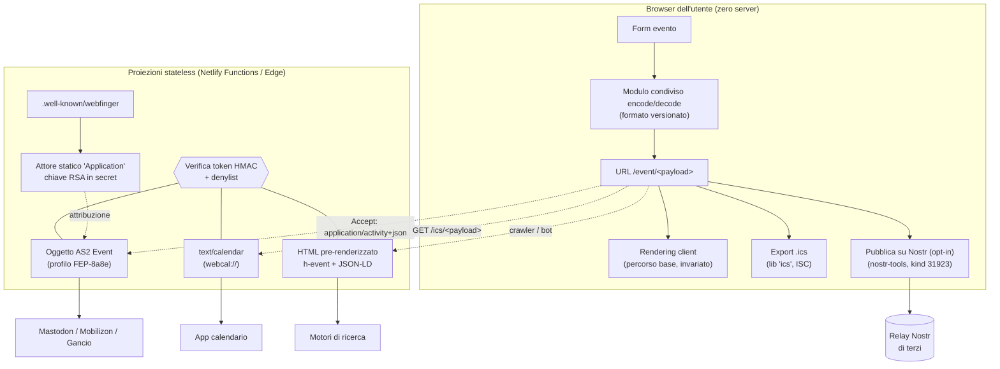

# Evento decentralizzato — architettura di riferimento

**Stato:** proposta approvata, in attesa di implementazione per fasi
**Basata su:** [fediverse-research.md](fediverse-research.md) (ricerca multi-agente con fact-checking, luglio 2026)
**Complementare a:** [architecture.md](architecture.md) (architettura applicativa attuale)

## I principi, in ordine di priorità

1. **No Data** — nessun dato *degli utenti* viene salvato da Evento. È ammesso stato di *configurazione dell'operatore* (chiavi in variabili d'ambiente, denylist nel deploy): segreti e policy, mai contenuti.
2. **No Login** — nessun account, mai, in nessuna funzionalità inclusa la federazione.
3. **Decentralizzato** — nessun punto centrale la cui scomparsa distrugge gli eventi; interoperabilità tramite standard aperti, non tramite piattaforme.
4. **Open source** — solo dipendenze con licenza approvata OSI.
5. **Facile per chiunque** — ogni capacità avanzata è opzionale e non complica il percorso base "compila → condividi il link".

## Principio architetturale: l'URL è il documento

L'evento resta ciò che è oggi: un payload autocontenuto codificato nell'URL. **Ogni nuova capacità è una proiezione pura, deterministica e stateless di quel payload in uno standard aperto.** Niente viene mai scritto: la stessa richiesta produce sempre la stessa risposta, calcolata al volo.

Da questo principio la decentralizzazione emerge per tre vie complementari, nessuna delle quali richiede un database:

| Via | Meccanismo | Che cosa decentralizza |
|---|---|---|
| **Replicabilità radicale** | Il formato dell'evento è una spec pubblica e versionata; chiunque può self-hostare un'istanza (deploy statico) e ogni istanza legge gli URL di ogni altra | L'infrastruttura: nessuna istanza è speciale, i link sopravvivono al dominio originale per semplice ri-hosting del path |
| **Standard aperti stateless** | ICS (RFC 5545), microformati h-event + JSON-LD schema.org, ActivityStreams 2.0 read-only | La *lettura*: calendari, motori di ricerca e piattaforme del Fediverso consumano l'evento senza chiedere niente a Evento |
| **Pubblicazione opt-in a stato zero** | Nostr NIP-52, firmato e spedito dal browser dell'utente ai relay | La *scrittura*: l'unico protocollo di federazione push in cui il publisher non deve mantenere alcuno stato |

La ricerca ha stabilito perché ci fermiamo qui: la federazione ActivityPub piena richiede follower persistenti, code di consegna e una inbox sempre attiva (un database sotto altro nome), e per un publisher senza follower avrebbe comunque reach quasi nulla — il Fediverso è push-to-inbox, e la scoperta passa da relazioni di follow che il modello anonimo di Evento non può coltivare. La superficie di scoperta realistica degli eventi di Evento è la ricerca web, che è esattamente ciò che alimentano h-event e JSON-LD.

## Vista d'insieme

Le frecce tratteggiate sono proiezioni calcolate per-request: nessuna di esse scrive alcunché.

## Strato 0 — Il formato evento come protocollo aperto

Il fondamento di tutto: il payload smette di essere un dettaglio implementativo e diventa **il protocollo del sistema**.

- **Formato versionato**: `{ v: 1, title, datetime, endDatetime?, location, description? }` — JSON serializzato e codificato base64url. Il campo `v` garantisce evoluzione senza rompere i link esistenti (regola: i decoder accettano sempre le versioni precedenti).
- **`endDatetime` opzionale**: necessario per mappare senza perdite su tutti i target — FEP-8a8e rende `endTime` obbligatorio (con marcatore per eventi a durata aperta), ICS ha `DTEND`, NIP-52 ha `end`, i lexicon AT hanno `endsAt`. In sua assenza le proiezioni usano il marcatore open-ended o una durata di default dichiarata.
- **Spec pubblica** (`docs/event-format.md`, da scrivere in fase 0): schema, encoding, regole di validazione e di compatibilità. È ciò che rende gli URL portabili tra istanze self-hostate — la forma di decentralizzazione più coerente con "No Data": non federare i dati, ma rendere banale replicare l'infrastruttura.
- **Un solo modulo encode/decode/validate**, condiviso tra client e functions. Oggi la logica è triplicata (`src/client/utils/eventUtils.js`, `src/client/services/event/eventService.js`, `netlify/functions/utils/validation.js`): il consolidamento è prerequisito di ogni strato successivo, perché le proiezioni server devono decodificare *esattamente* come il client.

## Strato 1 — Interop client-side (zero server, zero rischio)

Il massimo valore per riga di codice dell'intera ricerca, senza alcun costo architetturale:

- **Export ICS nel browser**: la libreria `ics` (licenza ISC, attivamente mantenuta) genera un `VEVENT` dal payload già presente nell'URL, offerto come download Blob. Compatibile con ogni app calendario, inclusi gli import di Mobilizon/Friendica/Hubzilla.
- **Link "aggiungi a Google/Outlook Calendar"** costruiti client-side (pura composizione di stringhe): comodi ma non garantiti dai vendor, quindi sempre affiancati — mai sostituiti — dall'ICS aperto. Al click i dati dell'evento raggiungono quel vendor: va detto nell'interfaccia.
- **Esclusione motivata**: il web component `add-to-calendar-button` è Elastic License 2.0, non approvata OSI — in conflitto con il principio 4.

## Strato 2 — Proiezioni server stateless

Estende la raggiungibilità dell'evento a consumatori che non eseguono JavaScript, mantenendo il determinismo: ogni risposta è funzione pura dell'URL.

- **Content negotiation su `/event/<payload>`**: alla richiesta `Accept: application/activity+json`, una function restituisce l'oggetto ActivityStreams 2.0 `Event` secondo il profilo FEP-8a8e, con il vocabolario location in stile Mobilizon (schema.org `Place`/`PostalAddress`) — il formato de facto degli eventi federati. Effetto: incollare un link Evento nella ricerca di Mastodon/Mobilizon/Gancio produce un oggetto risolvibile, e le piattaforme event-native lo mostrano come vero evento.
- **`/ics/<payload>` → `text/calendar`**: abilita i link `webcal://` e il fetch da parte di macchine (lo stesso modulo di generazione ICS dello strato 1, eseguito nella function).
- **Pre-rendering h-event + JSON-LD per i crawler**: i parser di microformati e i motori di ricerca leggono l'HTML grezzo senza eseguire JavaScript, quindi il DOM costruito lato client è invisibile proprio ai consumatori a cui h-event è destinato. Una edge function serve ai crawler l'HTML con markup `h-event` (CC0) e JSON-LD `schema.org/Event`. È l'investimento di scoperta più importante: la ricerca web è dove gli eventi di Evento possono davvero essere trovati.
- **Attore statico + WebFinger**: un documento attore di tipo `Application` (`events@<dominio>`, pattern a singolo attore d'istanza alla Gancio) con chiave RSA in un secret Netlify, e la risposta `/.well-known/webfinger` corrispondente. Serve solo a rendere gli oggetti AS2 attribuibili e fetchabili anche da istanze in authorized-fetch. **Publish-only: nessuna inbox.** Un endpoint inbox aperto costerebbe verifica firme per ogni consegna su fatturazione per-invocazione senza cap, esposto alle tempeste di `Delete` documentate del Fediverso — e non avremmo comunque stato su cui applicare ciò che riceve.

### Postura anti-abuso (vincolante per tutto lo strato 2)

Qualunque endpoint che renderizza lato server contenuto fornito nell'URL trasforma Evento in un host di contenuti first-party, anonimo e gratuito: il pattern di abuso degli URL shortener, con rischio concreto di flag Safe Browsing sull'intero dominio e di defederazione permanente via blocklist condivise. Perciò:

1. **Token di minting HMAC**: alla creazione, l'app appone all'URL un token `HMAC(chiave_server, payload)`. Le proiezioni server verificano il token prima di rispondere; senza token valido rispondono 404 e il contenuto esiste solo nel rendering client (che resta libero, come oggi — è la difesa accidentale ma reale dell'architettura attuale). Il token prova che l'URL è stato coniato tramite Evento, abilitando rate-limiting alla creazione. Trade-off accettato: ruotare la chiave (kill-switch di massa) invalida le *proiezioni server* dei vecchi URL, non i link stessi.
2. **Denylist deployabile**: hash dei payload segnalati, in configurazione; un redeploy è il meccanismo di takedown. Stato di configurazione, non dato utente.
3. **Etichettatura**: le proiezioni HTML dichiarano visibilmente "contenuto fornito dall'utente".
4. **Niente firma di contenuti arbitrari**: l'attore non firma mai in uscita payload non mintati.

## Strato 3 — Pubblicazione decentralizzata opt-in

- **"Pubblica su Nostr"**, interamente client-side: `nostr-tools` (pubblico dominio/Unlicense, attivamente mantenuta) firma un evento kind 31923 (tag obbligatori `d`, `title`, `start`) con una chiave usa-e-getta generata nel browser — o con l'estensione NIP-07 dell'utente, se presente — e lo spedisce via WebSocket a una rosa di relay pubblici. Evento non tocca nulla: è l'unica federazione push a stato zero per il publisher, e il modello di scoperta di Nostr (relay interrogabili per filtro, senza follow) è strutturalmente compatibile con un publisher anonimo.
- **Disclosure obbligatoria nell'interfaccia**: l'evento persisterà su relay di terzi con cancellazione solo best-effort (NIP-09); perdere la chiave usa-e-getta rende l'evento immodificabile; il pubblico dei client calendario Nostr è oggi molto piccolo. L'opt-in esplicito trasforma la deviazione da "No Data" in un confine di consenso: è l'utente, non Evento, a scegliere dove il suo evento vive.
- **Estensione futura (documentata, non nel target)**: delega opt-in a un'istanza Mobilizon (API GraphQL, bot OAuth2 con scope `write:event:*`) o Gancio — reach federata reale con zero codice di protocollo, al costo della persistenza presso un server terzo e della dipendenza dalle sue policy. Da riconsiderare se emergesse domanda reale di presenza in timeline federate.

## Decisioni (registro)

| # | Decisione | Motivazione | Alternativa scartata |
|---|---|---|---|
| D1 | L'URL resta l'unica fonte di verità; ogni feature è una proiezione pura | Preserva "No Data" per costruzione, non per disciplina | Introdurre storage "solo per la federazione" (è il bivio, non un incremento) |
| D2 | Formato evento come spec pubblica versionata | Decentralizzazione per replicabilità; i link sopravvivono alle istanze | Formato interno non documentato |
| D3 | `endDatetime` opzionale nel modello | Mapping senza perdite su FEP-8a8e/ICS/NIP-52/AT | Solo `datetime` (proiezioni non conformi) |
| D4 | Federazione AP limitata a read-only, publish-only, singolo attore | Inbox/follower = database + dati personali + costi senza cap; reach da zero follower ≈ 0 | Federazione piena (Fedify + KV store + migrazione da Netlify) |
| D5 | Anti-abuso: minting HMAC + denylist deployabile + etichettatura | Unica storia anti-abuso credibile senza dati utente; il rendering client resta libero | Nessuna mitigazione (rischio dominio) o moderazione con database |
| D6 | Nostr NIP-52 come unico canale di federazione push, opt-in | Unico protocollo a stato zero per il publisher; scoperta pull-based | AT Protocol (richiede account: viola "No Login") |
| D7 | Solo dipendenze OSI: `ics` (ISC), `nostr-tools` (Unlicense) | Principio 4 | `add-to-calendar-button` (Elastic-2.0) |
| D8 | Delega a Mobilizon/Gancio rimandata a estensione futura | Reach reale ma persistenza presso terzi; attivarla solo su domanda degli utenti | Includerla subito nel target |

## Non-goals espliciti

- **Inbox ActivityPub, follower, consegna push, RSVP federati** — richiedono persistenza; gli RSVP sono per definizione liste di partecipanti, cioè dati personali: incompatibili con il principio 1 finché regge.
- **Feed RSS/Atom e WebSub** — descrivono collezioni con ID stabili e topic mutabili: Evento non ha liste di eventi da enumerare né "aggiornamenti" da spingere (modifica = nuovo URL).
- **Account di qualunque tipo**, inclusi account "solo per federare" — principio 2.
- **Framework AP full-stack** (Fedify e simili) — richiedono KV store e code; Netlify non è tra i loro target documentati.

## Roadmap di implementazione

| Fase | Contenuto | Criteri di "pronto" |
|---|---|---|
| **0 — Fondamenta** | Spec `docs/event-format.md`; modulo unico encode/decode/validate condiviso client+functions; campo `endDatetime` opzionale nel form e nel formato (v1) | I tre punti di duplicazione attuali importano dal modulo unico; i vecchi URL (senza `v`) continuano a decodificare; test di round-trip encode→decode |
| **1 — Calendari** | Export ICS client-side (`ics`); link vendor Google/Outlook con avvertenza | Un evento creato si importa correttamente in almeno Google Calendar, Apple Calendar e Thunderbird |
| **2 — Proiezioni** | Minting HMAC alla creazione + verifica nelle functions; `/ics/<payload>`; content negotiation AS2 su `/event/`; pre-render h-event+JSON-LD per crawler; attore statico + WebFinger; denylist | L'URL di un evento incollato nella ricerca di un'istanza Mobilizon/Gancio risolve in un evento; il validator di event-federation.eu accetta l'oggetto AS2; un payload non mintato riceve 404 dalle proiezioni |
| **3 — Nostr** | Pulsante opt-in "Pubblica su Nostr" con disclosure; chiave usa-e-getta o NIP-07 | L'evento pubblicato è leggibile da un client NIP-52 interrogando i relay scelti |

Le fasi sono indipendenti a valle della 0: la 1 non richiede la 2, la 3 non richiede né 1 né 2.
